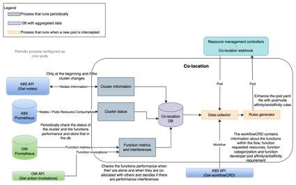

# co-location

## Description -- Extracted from D5.2 Section 6

The co-location strategies component, developed under Task T5.4, Optimized Service Co-location Strategies, is in charge of finding the most suitable placement decision for a new Pod to be deployed, taking into account the workloads that are running in a cluster in order to reduce the noisy behavior effect.  The co-allocation strategies look at the complementarity of deployed Pods, that is, CPU intensive, memory intensive, or network intensive, but also at the requirements defined by the application at design time in WP3. Some functions may require a given hardware to be executed (e.g. GPU), some functions are not isolated, they are part of a workflow (e.g. a sequence of function invocations) that may run in the same node. Some functions may use a service and should be placed together with the service for improved performance. Those requirements are expressed with annotations by the applications designer in WP3 Functional and Semantic Continuum Services Design Framework. The application developer can also follow the Performance Pipeline Stage (described in D3.2) that leads to annotated information regarding the expected behavior of a function (CPU/memory/IO/network  resources needed). All this information is passed to the infrastructure where a concrete pod will be deployed and the associated YAML file will be updated to include Kubernetes node and inter-pod affinity rules, which are used by the scheduler. The scheduler will decide the placement of a concrete pod based on these rules  The node affinity constrains the nodes where the pod can be executed. For this purpose, nodes are labeled with key and value pairs, and the pod YAML will use that label and indicate if this is a required or preferred node. Inter-pod affinity and anti-affinity rules constrain the nodes where a pod can be deployed based on the labels of the pods that are already running on the cluster.  The coallocation component will be in charge of generating these affinity rules. Moreover, statistics regarding the actual consumption of resources the pods in the cluster are collected and used to classify pods according to their CPU/IO/Network/Memory, so that future executions of the same type of pod can take this information into consideration.  The infrastructure will also collect aggregated metrics of the resource usage for each node. This information will allow us to approximate the resource consumption of nodes.  The co-allocation component will use this information to produce the affinity rules for each pod to be scheduled.

### Design Specification

The goal of the co-location is to find a set of candidate nodes for the deployment of new pods based on the current running nodes (workload) in a given cluster. The co-location component is made out of 6 subcomponents as depicted in [Figure1](docs/images/architecture.png). The subcomponents are: a database, processes that run periodically and processes that run when a new pod is created. The cluster status and function execution metrics are stored in the co-location database, a Prometheus database. Three subcomponents run periodically: Cluster information, Cluster status, and  Function metrics and interferences. The data collection and the Rules generator are executed before a new pod is created.



Figure1. Co-location component architecture

The Cluster information process gets information about the nodes available in the Kubernetes cluster and their technical specifications (CPU, memory, disk type, GPU and network bandwidth). This information is obtained through the Kubernetes API. This process is executed when the Co-location component is deployed and periodically to check if the cluster status has changed. The information is stored into the Co-location database to be used by other subcomponents. The Cluster status subcomponent periodically checks the resource consumption of the nodes and the pods that are running in the Kubernetes cluster. This information is obtained from the Kubernetes Prometheus instance and is stored into the Co-location database. The Function metrics and interferences subcomponent gets information about the functions executed in the FaaS platform such as the execution time and the invocation time of the function to detect interferences with other functions executed at the same time in the same node. This information is kept in memory and also stored in the Co-location database to be used to generate the affinity/anti-affinity rules.

The Data collector subcomponent is executed each time the webhook intercepts the creation of a new Pod. This subcomponent retrieves the information from the Co-location database and the Workflow CRD and selects the set of nodes where the function can be allocated so that performance is not degraded. The subcomponent finds the nodes with the needed hardware resources and among them selects the nodes in which the function executed previously with the lower response time if the same functions are running concurrently. Otherwise, if there is no previous information, the less loaded node is selected. If none of these conditions are met, the nodes that have more available resources are recommended. The Rule generator subcomponent updates the pod yaml object to add the affinity and anti-affinity rules that will be used by the scheduler to deploy the pod.

* **Cluster information**: The Cluster information subcomponent retrieves the features of the nodes that belong to the cluster. This subcomponent is executed periodically, i.e., once per day. The component uses the Kubernetes Python library, this a Python client for the Kubernetes API. The component gets features of each node registered in the Kubernetes cluster, the memory, the number of cores and all the labels set to the nodes like GPU, disk type and the DMS component keydb label. The labels have to be set by the cluster administrator. This information is stored in the Co-location database.

* **Cluster statu**s**: The Cluster status subcomponent collects the CPU, memory, network, and disk metrics of each node within the Kubernetes cluster. This component is executed periodically, i.e. every 5 minutes. The metrics are provided by Kubernetes and accessed using the prometheus_api_client and Kubernetes Python libraries. These metrics are stored in the Co-location database.

* **Function metrics and interferences**: The Function metrics and interference subcomponent is executed periodically, i.e., every 5 minutes. This component gets information about the execution and starting time of the functions executed in the FaaS platform during the last 5 minutes and updates the database.
The OpenWhisk(OW) client(wsk) is used to retrieve the information about the functions executed in the last 5 minutes:

    ```bash
    $wsk -i activation list –-since 1694428612 –-upto 1649928912 –-limit 200
    ``````

    This command returns the list of functions (up to 200) executed from timestamp 169442861 till timestamp 1649928912. Once the activation list is collected, the function metrics and interference sub-component analyzes the activations of each function and checks if the function has been executed alone or collocated with other functions.  The component gets the information about the pod which runs the function and where the pod runs. Then, the latency, the CPU usage, the number of vcores, memory and network I/O used by the function are stored into the database.

* **Co-location Database**: The Co-location database is a central component in the co-location component used by the rest of the subcomponents.  The information is stored into the temporal series Prometheus database each time the process that collects the information (Cluster information, cluster status and Function metrics and interference components) stores their output in the database.

* **Data collection**: The Data collection subcomponent is executed each time a pod creation is intercepted by the mutating webhook. This component receives the pod YAML object, which contains the workflow CRD name in the metadata>annotations>workflow field. This sub-component accesses the workflow CRD object the pod belongs to. The workflow CRD stores the workflow structure (function execution order) and annotations related to the workflow as shown in Code 1. For instance, if all functions must or should be executed in the same node (affinities) or in different ones (anti-affinities).

    The relevant information extracted from the workflow CRD is:

    * Cluster: This annotation is required to know if all the functions of the workflow are executed in the same cluster. In case the functions are executed in the same cluster, the component has to take into consideration interferences of the different functions with the ones running in the cluster.
    * optimizationGoal and importance: If the optimization goal is performance, the component has to minimize the interferences of the function with the ones that are deployed in the cluster.
    * extraResources: Allows to filter the nodes from the available ones and create nodes affinity/anti-affinity rules.

    ```yaml
    apiVersion: wp5.physics-faas.eu/v1alpha1
    kind: Workflow
    metadata:
    name: hello-sequence
    namespace: physics-namespace
    annotations:
        id: "19fe4293742e0b2c"
        version: "1"
        cluster: cluster1
    spec:
    execution: NativeSequence
    listOfActions:
        - id: 339d2ef8b0b29795
        - id: 3a807141f16764a5
    native: true
    platform: openWhisk
    type: flow
    actions:
    - name: hello
        description: "hello"
        id: 339d2ef8b0b29795
        version: 1.0.0
        runtime: nodejs
        code: "function main(msg) {\nmsg.payload=msg.payload+' hello';\nreturn msg;}"    
        annotations:
        optimizationGoal: Performance
        importance: "High"     
        resources:
        limits:
            memory: 128
        requests:
            cpu: 1
            memory: 128
        extraResources:
        gpu: true
        diskType: ssd
        performanceProfile:
        cpu: medium
        memory: low
        networkTransmitted: low
    - name: world
        description: "world"
        version: 1.0.0
        id: 3a807141f16764a5
        runtime: nodejs
        code: |
        function main(msg) {
        //implies affinity with the other function in the sequence
        msg.payload=msg.payload+' world';
        return msg;
        }
        resources:
        limits:
            memory: 256
    ```

    Code 1: WorkflowCRD example

    Then the algorithm first restricts the candidate nodes based on the hardware requirements to reduce the search space. For instance, if the new pod requires a GPU, nodes in the cluster without a GPU are not taken into consideration. The nodes that fulfill the hardware requirements are considered as candidates.
    Next, the algorithm gets the functions that are running in candidate nodes at this time and checks for interferences. If the optimization goal specified for the Pod to be deployed is performance and the importance is high the algorithm discards the nodes where functions that may cause interference are running. If there are not enough nodes or the importance is lower the algorithm minimizes the interference selecting the nodes with no interferences or with functions that can cause a low impact in the performance of the function running in the pod to be deployed.
    When a new function arrives to the cluster and there are no records about how the function behaves in this cluster, the profile annotations available in the WorkflowCRD are considered. First, the algorithm is going to consider executing the function alone to analyze the resources consumption. If this is not possible due to all nodes in the cluster having other functions deployed, the algorithm selects the nodes with functions that have different behavior/profile to minimize the impact in the performance. From then on, this new function will be monitorized by the Function metrics and interferences component. If there are records about the function the algorithm uses the interference registry to select the most suitable nodes.

* **Rules generator**: Based on the outcome provided by the Data collection subcomponent, a set of affinity/antiaffinity rules are created.  The hardware requirements are translated into node/pod affinities/antiaffinities that depending if they are strong constraints, the affinity will be required (requiredDuringSchedulingIgnoredDuringExecution in Kubernetes) or optional (preferredDuringSchedulingIgnoredDuringExecution in Kubernetes). Each node that is an outcome of the Data collection algorithm (candidate to deploy the new pod) are translated node affinity rules. The interferences detected by the Data collection algorithm are set as pod antiaffinity rules. Other requirements of the pod that come in the workflow such as some functions that should (not) be co-allocated, are added to the pod YAML file as inter-node affinity (anti-affinity).

    An example of affinity and antiaffinity rules is represented in Code 2 where two node affinity and a pod antiaffinity rules have been set for the pod intercepted by the Mutating webhook that is going to deploy the hello function. The Node affinity rules have been set to satisfy extra resources requests of GPU and SSD disk. Then, the pod antiaffinity rule has been set to avoid the pod to be deployed within a node that has a function with the label openwhisk/action: Model_training. This type of antiaffinity rule is set due to interferences detected when the two functions are executed together. The algorithm detects that running the function to be deployed with model_training functions decreases the performance.

    ```yaml
    apiVersion: v1
    kind: Pod
    metadata:
    name: wskowdev-invoker-00-1-guest-hello
    spec:
    affinity:
        nodeAffinity:
        requiredDuringSchedulingIgnoredDuringExecution:
            nodeSelectorTerms:
            - matchExpressions:
            - key: disktype
                operator: In
                values:
                - ssd
            - key: gpu
                operator: In
                values:
                - yes
        podAntiAffinity:
        requiredDuringSchedulingIgnoredDuringExecution:
            - labelSelector:
            matchExpressions:
                - key: openwhisk/action
                operator: In
                values:
                - Model_training
            topologyKey: topology.Kubernetes.io/zone
    containers:
    - name: wskowdev-invoker-00-3278-guest-hello
        image: "gkousiou/NodeREDhelloaction"
    ```

## Project organization

* [co-locationLib](co-locationLib): Python library project.
* [docs](docs): Project documentation.
